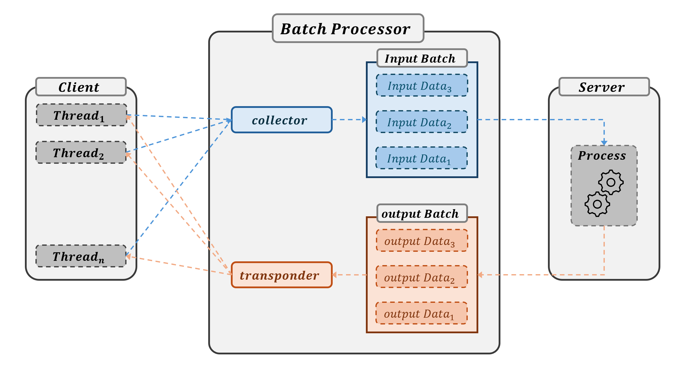

### 이 저장소(Repository)는 「비동기 환경에서의 배치 처리기(Batch Processor)」에 대한 내용을 다루고 있습니다.

***
작성자: YAGI<br>

최종 수정일: 2025-06-10
+ 2025-06-10: Batch Processor 구현 완료
***

<br>

***
+ 프로젝트 기간: 2025-06-07 ~ 2025-06-10
***

<br><br>


<b>Fig 1</b>. Schematic diagram of a batch processor. 각 Thread로부터 입력받은 데이터를 특정 배치 크기(Batch Size)로 묶어 일괄적으로 처리한 후, 이를 다시 입력처(Trhead)로 반환하는 모듈이다. 배치로 처리할 경우, 효율적인 딥러닝 모델 또는 특정 웹 서비스에서 활용할 수 있다.

<br><br>

## Getting Start

### Example
```python
from threading import Thread
from batchProcessor import BatchProcessor

class TestBP(BatchProcessor):
    def process(self, batch_input: tuple) -> tuple|list:
        '''사용자 용도에 맞춰 작성 요함\n
        * return 값은 반드시 `{batch_input}`의 길이와 동일해야 함
        * return 값의 형태는 `tuple` 또는 `list` 여야함


        Attrs:
            batch_input(tuple): ({'input_0': 0}, {'input_1': 5}, ...)
        '''
        #예시로 input에 10을 곱한 값을 반환
        return [10. * item['input'] for item in batch_input]

        
#timeout 초과 시, batch size에 도달하지 않았더라도,
# 요청(request)된 데이터를 배치로 묶어 처리
batch_processor = TestBP(
    batch_size=2,
    timeout=0.1,    
)


def worker(input: int) -> None:
    response = batch_processor.request(input=input)
    print(f'input: {input},\tresponse: {response}')


threads = tuple(Thread(target=worker, kwargs={'input': i}) for i in range(5))

for thread in threads:
    thread.start()

for thread in threads:
    thread.join()


'''
>>> input: 1,       response: 10.0
>>> input: 0,       response: 0.0
>>> input: 3,       response: 30.0
>>> input: 2,       response: 20.0
>>> input: 4,       response: 40.0
'''
```

<br><br>

## License
This project is licensed under the terms of the [MIT license](https://github.com/YAGI0423/batchProcessor/blob/main/LICENSE).